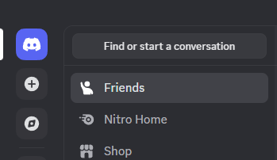

# Discover Add Server To Top

**DiscoverAddServerTop** is a plugin that moves the "Discover" and "Add Server" buttons above the server list divider in Discord, improving accessibility and workflow.

## Features

- Moves the **Add Server** and **Discover** button above the server list divider.
- Enhances navigation by placing these frequently used buttons in a more visible location.

## Preview



## Requirements

This plugin requires you to have Better Discord installed: [https://betterdiscord.app/](https://betterdiscord.app/)

## Installation

1. Download the [DiscoverAddServerTop.plugin.js](DiscoverAddServerTop.plugin.js) file.
2. Place it in your Discord plugin folder (e.g., for BetterDiscord or other plugin managers).
3. Enable the plugin from your plugin manager.

## Usage

Once enabled, the Discover and Add Server buttons will automatically appear above the server list divider.

## Optional: Swap Button Order

By default, the plugin moves the **Add Server** button above the divider, followed by the **Discover** button.

If you want the order reversed (**Discover first, then Add Server**), open the plugin file and replace this part:

```js
divider.parentNode.insertBefore(addBtn, divider);
divider.parentNode.insertBefore(discoverBtn, divider);
```

with:

```js
divider.parentNode.insertBefore(discoverBtn, divider);
divider.parentNode.insertBefore(addBtn, divider);
```

Essentially just swapping them arround...

## Contributing

Feel free to fork this repository and submit pull requests for improvements or fixes.

## License

This project is licensed under the MIT License - see the [LICENSE](LICENSE) file for details.

## Releases

[Download DiscoverAddServerTop.plugin.js v1.0.0](https://github.com/relykxdev/discover-add-server-top/releases/download/v1.0.0/DiscoverAddServerTop.plugin.js)
